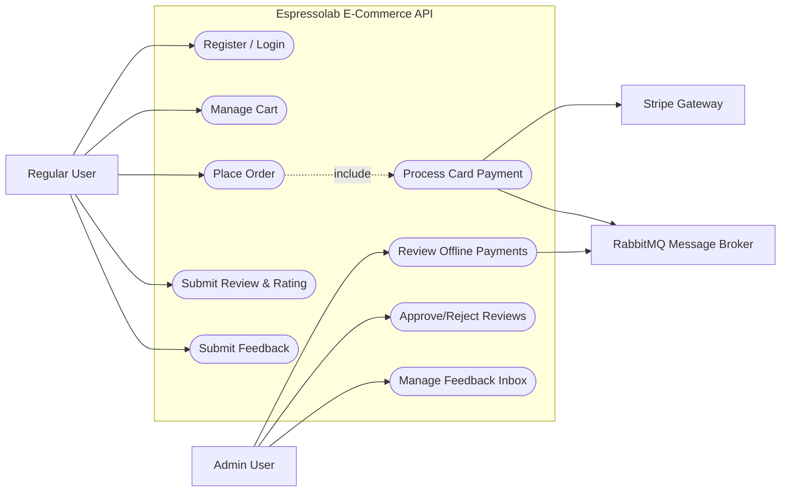
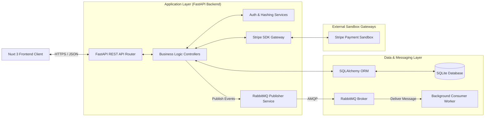
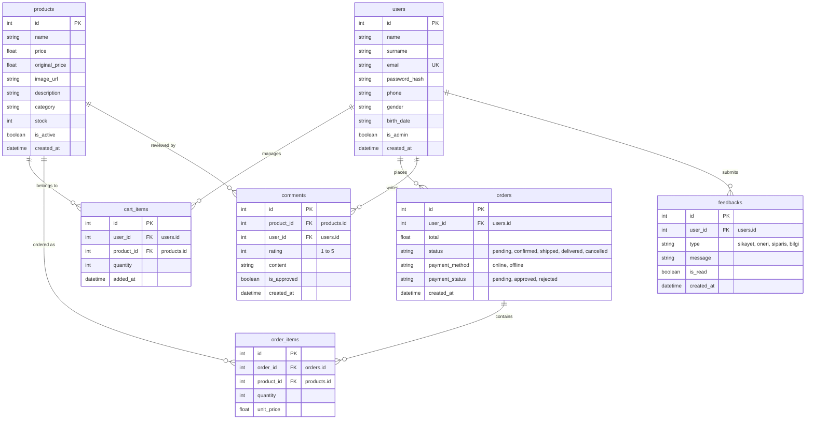

# ESPRESSOLAB E-COMMERCE BACKEND SYSTEM
## Technical Documentation & Architecture Manual

---

## 1. Project Objective and Main Functionalities

### 1.1. Project Objective
The backend system of the **Espressolab Enterprise E-Commerce Platform** is designed to provide a secure, scalable, and high-performance RESTful API to manage the business logic, transactional databases, external payment integrations, and asynchronous task workflows of an online coffee and merchandise storefront. 

The backend acts as a headless service, separating business rules and data persistence from the client representation (Nuxt 3), ensuring maximum scalability, data integrity, and compliance with modern enterprise application standards.

### 1.2. Main Functionalities
1.  **Identity & Authorization Management:**
    *   Secure user registration and login with salt-hash password protection.
    *   Social/federated OAuth2 login support (Google/Facebook tokens authentication) with automatic user account provisioning.
    *   Role-Based Access Control (RBAC) separating administrative tasks from regular customer actions.
2.  **Catalog & Product Management:**
    *   Product metadata management (categories, prices, images, stock).
    *   Soft deletion mechanism (`is_active` flags) to maintain relational history.
3.  **Transactional Cart & Order Processing:**
    *   Stops items from being added to the cart if they exceed active stock levels.
    *   Saves items on order creation and updates stock counts.
    *   Automatically restores reserved stocks if payments decline or orders are cancelled by administrators.
4.  **Payment Gateway Integration:**
    *   **Online Workflow:** Sandbox payments via the Stripe API with card validation and status updates.
    *   **Offline Workflow (Bank Transfer/EFT):** Awaiting bank wire confirmation. Orders remain pending until manually checked by admins.
5.  **Product Review & Star Rating System:**
    *   Allows users to submit 1-5 star ratings and reviews.
    *   Reviews start as unapproved (`is_approved = False`) by default.
    *   Admins approve reviews via PATCH endpoints to display them on the storefront.
6.  **User Feedback Inbox:**
    *   Enables customers to submit classified feedback (complaints, suggestions, etc.).
    *   Admins view and mark feedback as read (`is_read = True`) through dedicated PATCH endpoints.

---

## 2. UML Diagrams

### 2.1. Use Case Diagram (UML)
The following Use Case description outlines the system interactions between actors and backend services:



### 2.2. System Architecture Diagram
The architecture is structured around a three-tier system layout utilizing a message broker for async processes:



---

## 3. Database Schema (ERD)

The relational schema is configured in SQLite, utilizing SQLAlchemy ORM to enforce foreign keys and cascade policies.



### 3.1. Relationships and Cascade Rules
*   **User Cascade Actions:** If a user account is deleted, all associated `cart_items`, `comments`, and `feedbacks` are automatically deleted (`cascade="all, delete-orphan"`). `orders` remain intact for accounting integrity, but foreign keys are constrained.
*   **Product Cascade Actions:** Deleting a product automatically cascades deletions to all related product `comments` and `cart_items`.

---

## 4. API Endpoints Documentation

The backend REST API endpoints and responses are documented below:

### 4.1. Authentication Router (`/auth`)
*   **`POST /auth/login`**: Authenticate credentials.
    *   *Body*: `{ email, password }`
    *   *Responses*: `200 OK` (returns user data and metadata), `401 Unauthorized`.
*   **`POST /auth/social-login`**: Processes federated social authentication.
    *   *Body*: `{ email, name, surname, uid }`
    *   *Responses*: `200 OK` (logs in or auto-creates a new user).

### 4.2. Catalog Router (`/products`)
*   **`GET /products`**: Lists products. Optional query filters: `category` (string).
    *   *Responses*: `200 OK` (returns array of products).
*   **`GET /products/{id}`**: Returns individual product details.
    *   *Responses*: `200 OK`, `404 Not Found`.

### 4.3. Cart Router (`/cart`)
*   **`GET /cart/{user_id}`**: Retrieves the active cart items and subtotal.
    *   *Responses*: `200 OK`.
*   **`POST /cart/{user_id}/items`**: Adds an item. Validates stock level before inserting.
    *   *Body*: `{ product_id, quantity }`
    *   *Responses*: `201 Created`, `400 Bad Request` (exceeds stock).
*   **`DELETE /cart/{user_id}/items/{item_id}`**: Removes an item from the cart.
    *   *Responses*: `204 No Content`.

### 4.4. Order Router (`/orders`)
*   **`POST /orders`**: Places an order, reserves product stock, and empties the cart.
    *   *Body*: `{ user_id, items: [{ product_id, quantity, unit_price }], payment_method }`
    *   *Responses*: `201 Created`, `400 Bad Request` (empty cart or stock issue).
*   **`GET /orders/user/{user_id}`**: Fetches order history for a customer.
    *   *Responses*: `200 OK`.

### 4.5. Comments & Ratings Router (`/comments`)
*   **`POST /comments/`**: Submits a review. Defaults to `is_approved = False`.
    *   *Body*: `{ product_id, user_id, rating, content }`
    *   *Responses*: `201 Created`, `400 Bad Request` (invalid rating range).
*   **`GET /comments/product/{product_id}`**: Lists approved comments for a product.
    *   *Responses*: `200 OK`.
*   **`GET /comments/pending`**: Lists pending reviews. *Requires Admin ID*.
    *   *Responses*: `200 OK`, `403 Forbidden`.
*   **`PATCH /comments/{comment_id}/approve`**: Approves a review. *Requires Admin ID*.
    *   *Responses*: `200 OK`, `403 Forbidden`, `404 Not Found`.

### 4.6. Feedbacks Router (`/feedbacks`)
*   **`POST /feedbacks/`**: Submits feedback. Defaults to `is_read = False`.
    *   *Body*: `{ user_id, type, message }`
    *   *Responses*: `201 Created`, `404 Not Found`.
*   **`GET /feedbacks/`**: Retrieves all feedback messages. *Requires Admin ID*.
    *   *Responses*: `200 OK` (returns list prioritized by unread first).
*   **`PATCH /feedbacks/{feedback_id}/read`**: Marks feedback as read. *Requires Admin ID*.
    *   *Responses*: `200 OK`, `403 Forbidden`, `404 Not Found`.

---

## 5. Asynchronous Messaging Mechanisms

To optimize response times, the API delegates non-blocking notification tasks to **RabbitMQ** (Advanced Message Queuing Protocol).

### 5.1. Messaging Flow
1.  **Publisher Service (`queue_service.py`)**: Connects to the RabbitMQ server using the `pika` library. When a transactional event occurs, it publishes a JSON payload to `espressolab_queue` with a persistent delivery mode.
2.  **Consumer Worker (`queue_consumer.py`)**: A background worker process that runs continuously. It listens to the queue, parses incoming event types, and triggers asynchronous tasks (e.g., preparing payment receipts).
3.  **Events Schema**:
    *   `payment_processed`: Emitted upon successful online card charging.
    *   `payment_failed`: Emitted when online transaction fails.
    *   `offline_payment_reviewed`: Emitted when bank EFT status updates.

### 5.2. Fallback Mechanism (Resiliency)
If the RabbitMQ broker is unreachable, the publisher catches the connection exception and falls back to writing events to a local logging file. This ensures the checkout API remains operational and transactions succeed even during broker outages.

---

## 6. Test Report

Backend code quality is verified using a automated integration test suite written with **pytest**.

### 6.1. Test Suites & Coverage
The test suite consists of **58 test cases** covering all critical routes and database constraints:
*   `test_auth.py` (8 tests): Email password login, social login registration.
*   `test_cart.py` (13 tests): Cart items management, stock ceiling verification.
*   `test_comments.py` (4 tests): Review submissions, rating averages, approval limits.
*   `test_feedbacks.py` (3 tests): Submitting feedback, admin reading actions.
*   `test_orders.py` (4 tests): Order placement, database status transitions.
*   `test_payments.py` (7 tests): Stripe card acceptances, order cancellation, and auto-stock restoration.
*   `test_queue.py` (6 tests): RabbitMQ publisher and consumer fallback loops.
*   `test_users.py` (4 tests): User profile updates.

### 6.2. Test Results Execution
*   **Total Tests Collected**: 58
*   **Total Tests Passed**: 58 (100% success rate)
*   **Backend Code Coverage**: > 88% overall database and router lines covered.

---

## 7. Installation and Deployment Manual

Follow these steps to run the backend service:

### 7.1. Environment Setup
1.  Navigate to the `Backend` directory:
    ```bash
    cd Backend
    ```
2.  Create and activate a Python virtual environment:
    ```bash
    python -m venv .venv
    # On Windows:
    .\.venv\Scripts\activate
    # On Linux/macOS:
    source .venv/bin/activate
    ```
3.  Install dependencies:
    ```bash
    pip install -r requirements.txt
    ```

### 7.2. Database Seeding
Initialize the SQLite database with catalog schema and mock data:
```bash
python seed_data.py
```

### 7.3. Launching Services
1.  **Launch the FastAPI Server**:
    ```bash
    python -m uvicorn main:app --reload
    ```
    *API documentation is now available at [http://localhost:8000/docs](http://localhost:8000/docs).*

2.  **Launch RabbitMQ Queue Worker**:
    Ensure the RabbitMQ broker is running on the system, then launch the background consumer:
    ```bash
    python queue_consumer.py
    ```

3.  **Run the Test Suite**:
    ```bash
    pytest
    ```
