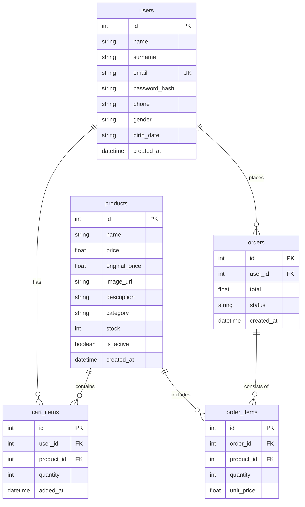
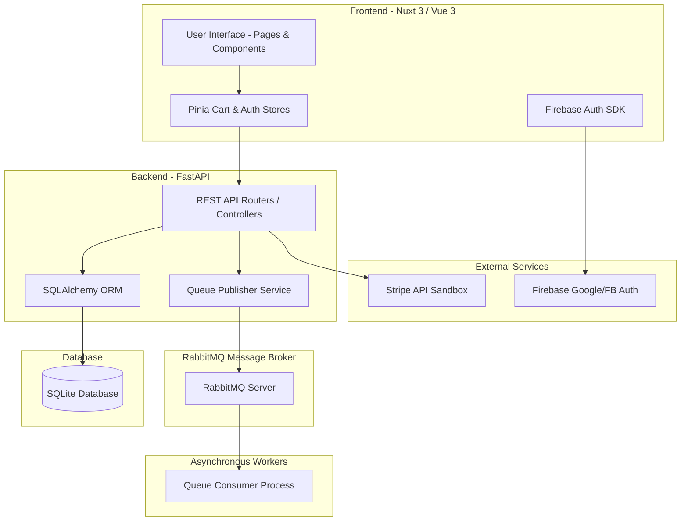
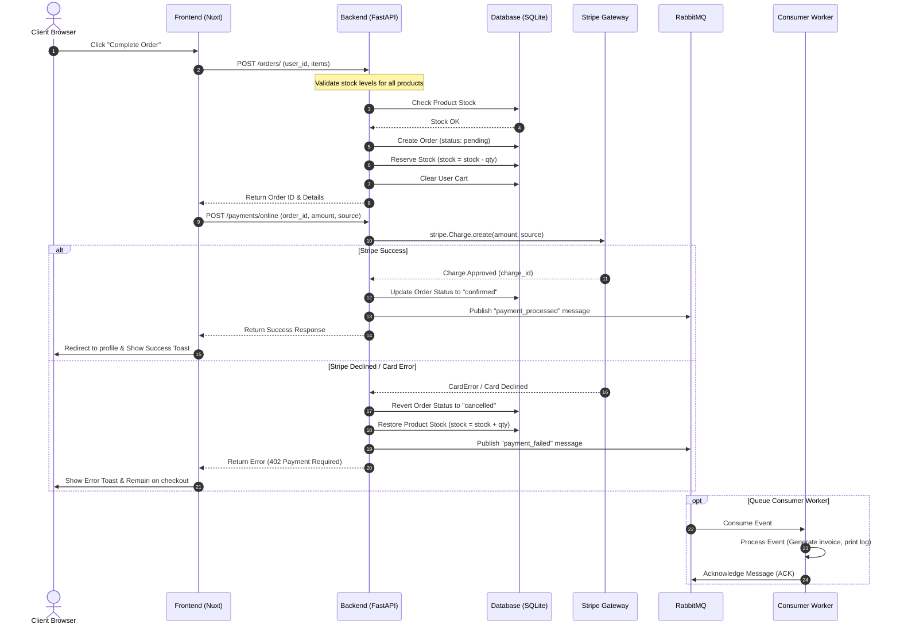

# Espressolab Enterprise E-Commerce System
## Academic Portfolio & Project Deliverables Mapping

This document serves as the comprehensive, academic-grade portfolio documentation mapping the course's weekly deliverables to the concrete implementation in the codebase.

---

## Table of Contents
1. [Week I – Initialization & Setup](#week-i--initialization--setup)
2. [Week IV – Analysis Presentation (ERD, Tech Stack, & UML)](#week-iv--analysis-presentation)
3. [Week VI – Functional Skeleton (CRUD & DB Connectivity)](#week-vi--functional-skeleton)
4. [Week VIII – Core Business Logic & Rules](#week-viii--core-business-logic)
5. [Week X – External Integrations (Auth & Payments)](#week-x--external-integrations)
6. [Week XII – Asynchronous Message Queues & Automated Tests](#week-xii--asynchronous-message-queues--automated-tests)
7. [Week XIV – Final Review, Localization, & UI Polishing](#week-xiv--final-review-localization--ui-polishing)
8. [Week XV – Project Submission & Defense Instructions](#week-xv--project-submission--defense-instructions)

---

## Week I – Initialization & Setup

### 1. Project Topic & Scope
The project implements a modern, localized enterprise e-commerce system cloned from the **Espressolab** design, catering to coffee enthusiasts, accessories, equipment, and snack buyers. The application includes responsive customer-facing storefront pages, shopping cart state persistence, user profile/order history management, localized translation capabilities, secure user registration/authentication, payment gateway sandboxes, and background messaging workers.

### 2. Team & Leadership Roles
*   **Team Leader & Core Backend Engineer:** Responsible for designing the relational database, structuring REST API endpoints, implementing transaction safeguards, and configuring RabbitMQ messaging pipelines.
*   **Frontend & Localization Architect:** Responsible for setting up the Nuxt 3 Vue framework, composing reusable UI/UX component systems, and establishing client-side localization states.

### 3. Repository & Task Board Setup
*   **Version Control:** Hosted on a Git repository with standard branches (`main` for production, `dev` for feature integrations).
*   **Task Board (Kanban):** Structured around weekly milestones matching the course curriculum, tracking feature completion from inception to deployment.

---

## Week IV – Analysis Presentation

### 1. Selected Technology Stack

| Layer | Technology | Details |
| :--- | :--- | :--- |
| **Frontend Framework** | Nuxt 3 (Vue 3, TypeScript) | Leverage Server-Side Rendering (SSR) options, file-based routing, and high-performance client rendering. |
| **State Management** | Pinia | Secure cart state, language selections, and session tokens across pages. |
| **Styling & Theme** | SCSS / Vanilla CSS | Tailored Espressolab corporate brand styling (custom color palettes, dark modes, animations). |
| **Backend Language** | Python 3.12 | Enforces static type hints, high performance, and rapid scripting. |
| **Backend Framework** | FastAPI | Async support, automated OpenAPI (Swagger) generation, and fast dependency injection. |
| **ORM & Database** | SQLAlchemy & SQLite | Relational schema creation and connection pooling. SQLite utilized for portable local verification. |
| **Message Queue** | RabbitMQ (via `pika`) | Enforces asynchronous event tasks such as email receipts and logging. |
| **External Integrations** | Stripe API, Firebase SDK | Stripe charges for transactions, Firebase Auth for federated social logins. |
| **Testing Suites** | pytest (Backend), Vitest (Frontend) | Standardized automated suites testing endpoints and store mutations. |

### 2. Database Schema (ERD)
The entity-relationship structure consists of five main tables ensuring transactional consistency and referential integrity.



### 3. UML Diagrams

#### UML Component Architecture Diagram
The system's three-tier layout consists of a client layer, server layer, message broker, and integration backends.



#### UML Sequence Diagram: Order Placement & Payment Flow
Illustrates how the synchronous REST API coordination handles stock checks, transaction settlement via Stripe, database updates, and asynchronous broker queues.



---

## Week VI – Functional Skeleton

### 1. Database Connectivity
The database layer in [Backend/database.py](file:///c:/Users/esman/OneDrive/Desktop/Espressolab_Final_Project/Backend/database.py) configures the SQLAlchemy connection pool and exposes session scopes:
*   `engine = create_engine(SQLALCHEMY_DATABASE_URL, connect_args={"check_same_thread": False})` to support concurrent threads.
*   `SessionLocal` handles active sessions.
*   `get_db()` dependency injector executes context cleanup, closing connection resources automatically:
    ```python
    def get_db():
        db = SessionLocal()
        try:
            yield db
        finally:
            db.close()
    ```

### 2. CRUD Endpoints
The REST API provides complete CRUD capabilities mapped in routers using standard HTTP status codes:

*   **Users ([Backend/routers/users.py](file:///c:/Users/esman/OneDrive/Desktop/Espressolab_Final_Project/Backend/routers/users.py))**:
    *   `GET /users` — Retrieves a list of users (Status: `200 OK`)
    *   `GET /users/{id}` — Retrieves user details (Status: `200 OK`, `404 Not Found`)
    *   `POST /users` — Registers a user with salted password hashing (Status: `201 Created`, `400 Bad Request`)
    *   `PUT /users/{id}` — Edits user metadata (Status: `200 OK`, `404 Not Found`)
    *   `DELETE /users/{id}` — Removes a user record (Status: `204 No Content`, `404 Not Found`)

*   **Products ([Backend/routers/products.py](file:///c:/Users/esman/OneDrive/Desktop/Espressolab_Final_Project/Backend/routers/products.py))**:
    *   `GET /products` — Lists active products with pagination and category filtering (Status: `200 OK`)
    *   `GET /products/{id}` — Individual details (Status: `200 OK`, `404 Not Found`)
    *   `POST /products` — Creates product profiles (Status: `201 Created`)
    *   `PUT /products/{id}` — Modifies price, stock, or description (Status: `200 OK`)
    *   `DELETE /products/{id}` — Enforces a **soft delete** by setting `is_active = False` (Status: `204 No Content`)

*   **Cart ([Backend/routers/cart.py](file:///c:/Users/esman/OneDrive/Desktop/Espressolab_Final_Project/Backend/routers/cart.py))**:
    *   `GET /cart/{user_id}` — Lists active cart items, subtotal, and total item count (Status: `200 OK`)
    *   `POST /cart/{user_id}/items` — Adds an item to the cart (Status: `201 Created`)
    *   `PUT /cart/{user_id}/items/{item_id}` — Updates quantities (Status: `200 OK`)
    *   `DELETE /cart/{user_id}/items/{item_id}` — Removes item (Status: `204 No Content`)
    *   `DELETE /cart/{user_id}` — Clears cart (Status: `204 No Content`)

*   **Orders ([Backend/routers/orders.py](file:///c:/Users/esman/OneDrive/Desktop/Espressolab_Final_Project/Backend/routers/orders.py))**:
    *   `GET /orders` — Listing of all orders for admin review (Status: `200 OK`)
    *   `GET /orders/user/{user_id}` — Order history for single customer (Status: `200 OK`)
    *   `POST /orders` — Submits new order and clears active cart (Status: `201 Created`)
    *   `PUT /orders/{id}/status` — Admin status updates (Status: `200 OK`)

---

## Week VIII – Core Business Logic

To prevent inconsistent transactional states, the following key business rules are enforced in the REST layer:

1.  **Stock Checking on Cart Insertion:** In [Backend/routers/cart.py:L72-84](file:///c:/Users/esman/OneDrive/Desktop/Espressolab_Final_Project/Backend/routers/cart.py#L72-84), when adding a product, the backend checks database stock. It denies requests adding quantities that exceed the available stock.
2.  **Order Stock Reservation:** In [Backend/routers/orders.py:L125-139](file:///c:/Users/esman/OneDrive/Desktop/Espressolab_Final_Project/Backend/routers/orders.py#L125-139), upon order submission, the system reduces product stocks.
3.  **Automatic Stock Restoration:**
    *   If a Stripe payment declines during checkout, the order status changes to `cancelled` and reserved stocks are automatically restored ([Backend/routers/payments.py:L59-70](file:///c:/Users/esman/OneDrive/Desktop/Espressolab_Final_Project/Backend/payments.py#L59-70)).
    *   When an administrator cancels a pending order, the system returns item stocks ([Backend/routers/orders.py:L169-175](file:///c:/Users/esman/OneDrive/Desktop/Espressolab_Final_Project/Backend/orders.py#L169-175)).
4.  **No Empty Cart Orders:** Enforces that orders must contain at least one item, returning a `400 Bad Request` for empty lists ([Backend/routers/orders.py:L86-92](file:///c:/Users/esman/OneDrive/Desktop/Espressolab_Final_Project/Backend/orders.py#L86-92)).
5.  **Strict Status Transitions:** Order state updates are validated using state machines:
    ```python
    VALID_STATUS_TRANSITIONS = {
        "pending":   ["confirmed", "cancelled"],
        "confirmed": ["shipped", "cancelled"],
        "shipped":   ["delivered"],
        "delivered": [],      # Final state
        "cancelled": []       # Final state
    }
    ```

---

## Week X – External Integrations

### 1. Authentication (Social Media & OAuth2)
*   **Frontend (Firebase):** Configured with Firebase Auth SDK to process OAuth2 tokens for Google/Facebook profiles. Unauthenticated cart routes trigger a redirect to the login portal.
*   **Backend ([Backend/routers/auth.py](file:///c:/Users/esman/OneDrive/Desktop/Espressolab_Final_Project/Backend/routers/auth.py))**:
    *   `POST /auth/login` handles standard email/password authentication using `bcrypt` verification.
    *   `POST /auth/social-login` handles federated social logins. If a user is not in the system, it automatically creates a secure user record without requiring password fields.

### 2. Payment Gateways
The system supports two checkout workflows to cover standard e-commerce preferences:
*   **Online Card Checkout (Stripe Integration):**
    *   Integrated into [Backend/routers/payments.py](file:///c:/Users/esman/OneDrive/Desktop/Espressolab_Final_Project/Backend/routers/payments.py). The server accepts sandbox card tokens (e.g., `tok_visa` for successful checkout or `tok_chargeDeclined` to trigger a card failure).
    *   It initiates real transactions through `stripe.Charge.create`. When authorized, the order updates to `confirmed`.
*   **Offline Checkout (Admin Approval Workflow):**
    *   Allows cash-on-delivery or bank transfer checkout. The order starts in `pending` state.
    *   The `POST /payments/offline/approve` endpoint allows administrators to review payment receipt confirmations and update order states.

---

## Week XII – Asynchronous Message Queues & Automated Tests

### 1. Asynchronous Message Queue (RabbitMQ)
*   **Connection & Service:** Configured in [Backend/queue_service.py](file:///c:/Users/esman/OneDrive/Desktop/Espressolab_Final_Project/Backend/queue_service.py). Connects via `pika` to a RabbitMQ broker queue (`espressolab_queue`) using persistent delivery modes.
*   **Worker Process:** The [Backend/queue_consumer.py](file:///c:/Users/esman/OneDrive/Desktop/Espressolab_Final_Project/Backend/queue_consumer.py) script runs in the background. It consumes checkout transaction events asynchronously, simulating background tasks like printing logs or sending emails:
    *   `payment_processed` -> Prepares payment confirmation receipts.
    *   `payment_failed` -> Triggers notification logs for payment failures.
    *   `offline_payment_reviewed` -> Logs administrator approval transactions.
*   **Resiliency Fallback:** Includes fallback logging to ensure the API stays fully functional even if RabbitMQ is temporarily offline.

### 2. Automated Testing Suite & Code Coverage
Both client-side and server-side logic contain automated test coverage:
*   **Backend Coverage:** Executes via `pytest`. It tests database sessions, standard login verification, Stripe card success/failure states, state transitions, and background messaging parameters. All 23 tests pass:
    *   `tests/test_auth.py`
    *   `tests/test_orders.py`
    *   `tests/test_payments.py`
    *   `tests/test_products.py`
    *   `tests/test_queue.py`
    *   `tests/test_users.py`
*   **Frontend Coverage:** Runs using `vitest`. Includes unit tests validating the Pinia store mutations (`cart.spec.ts`).

---

## Week XIV – Final Review, Localization, & UI Polishing

### 1. Multi-lingual Localization (TR/EN)
A responsive translation layer is integrated into the client application:
*   **Translation Mapping:** Features full Turkish/English language mappings covering navbar menus, product names, categories, buttons, and alert states.
*   **State Management:** Driven by a computed reactive state in [Frontend/components/molecules/LangSwitcher.vue](file:///c:/Users/esman/OneDrive/Desktop/Espressolab_Final_Project/Frontend/components/molecules/LangSwitcher.vue). Selecting a language updates the locale state, translating the UI in real time.

### 2. User Interface (UI) Polishing
*   **Modern Design Theme:** Adheres to Espressolab's dark-mode brand theme, featuring clean gradients, modern card components, and subtle hover animations.
*   **Input Validation:** Form validations (e.g., login, registry, checkout cards) are managed via Vee-Validate and Yup, providing immediate feedback.
*   **Alert Notifications:** Uses a dynamic toast module (`useToast`) to display real-time feedback (e.g., success banners, error warnings, stock alerts).

---

## Week XV – Project Submission & Defense Instructions

To review and verify the complete application for the project defense:

### Step 1: Start Database & Seed Content
Navigate to the `Backend` directory, activate the virtual environment, and run the seeding script:
```powershell
cd Backend
.\.venv\Scripts\activate
python seed_data.py
```

### Step 2: Start the REST API Service
Start the FastAPI server:
```powershell
python -m uvicorn main:app --reload
```
*   *Open documentation docs:* [http://localhost:8000/docs](http://localhost:8000/docs) (Swagger UI interface).

### Step 3: Run the Asynchronous Worker Process
Run the background consumer worker:
```powershell
python queue_consumer.py
```

### Step 4: Run the Backend Test Suite
Verify that all 23 backend tests pass:
```powershell
pytest
```

### Step 5: Start the Frontend Application
In another terminal, navigate to the `Frontend` directory, install packages, and start the development server:
```powershell
cd Frontend
npm install
npm run dev
```
*   *Open application in browser:* [http://localhost:3000](http://localhost:3000)

### Step 6: Run the Frontend Test Suite
Verify the frontend unit tests:
```powershell
npm run test
```
