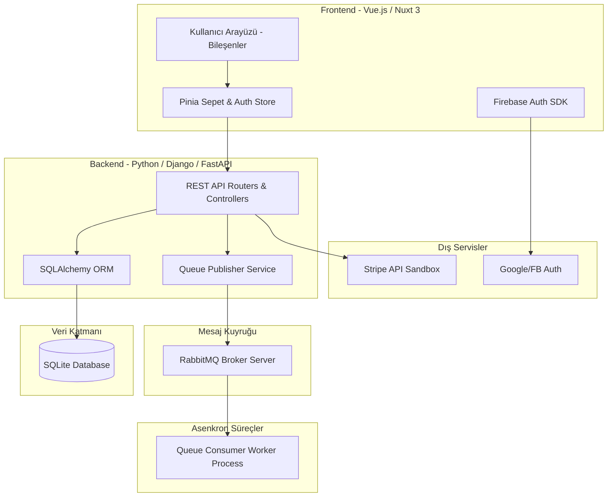
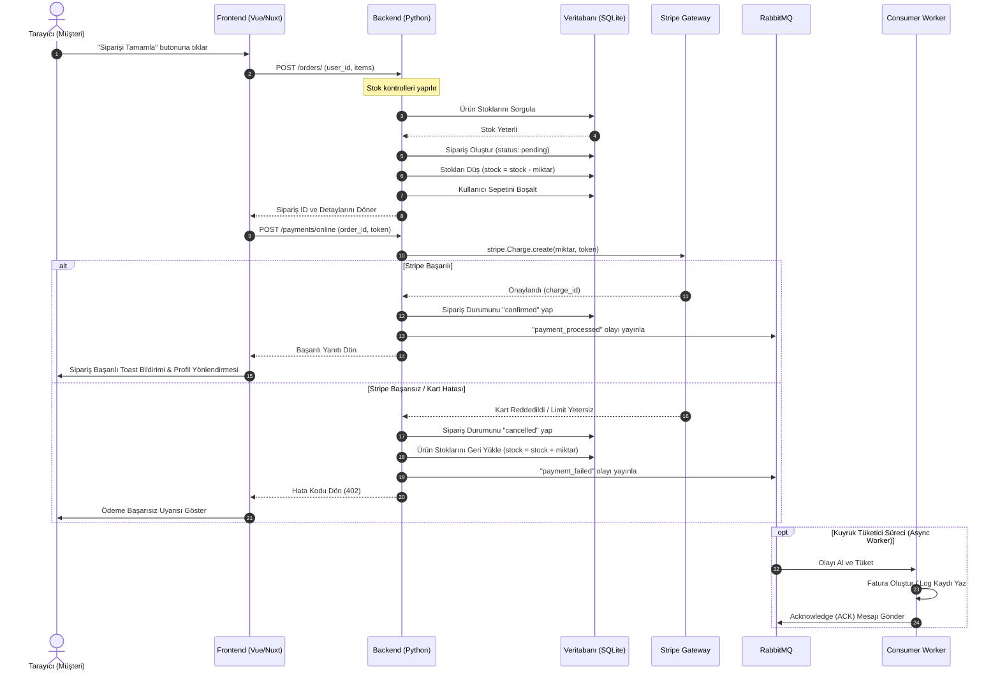
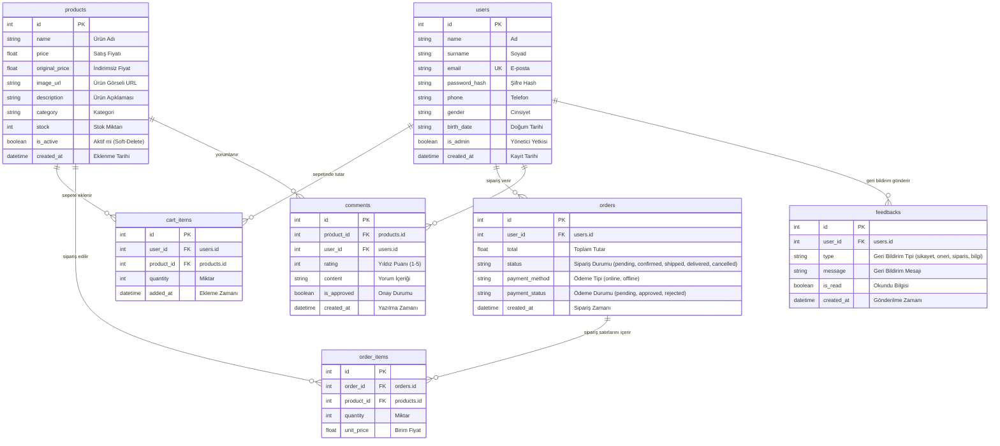
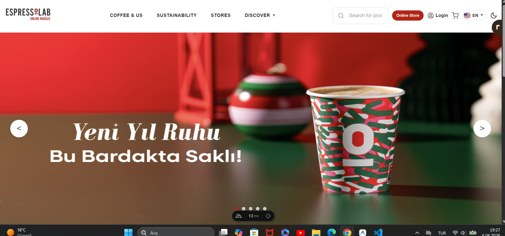
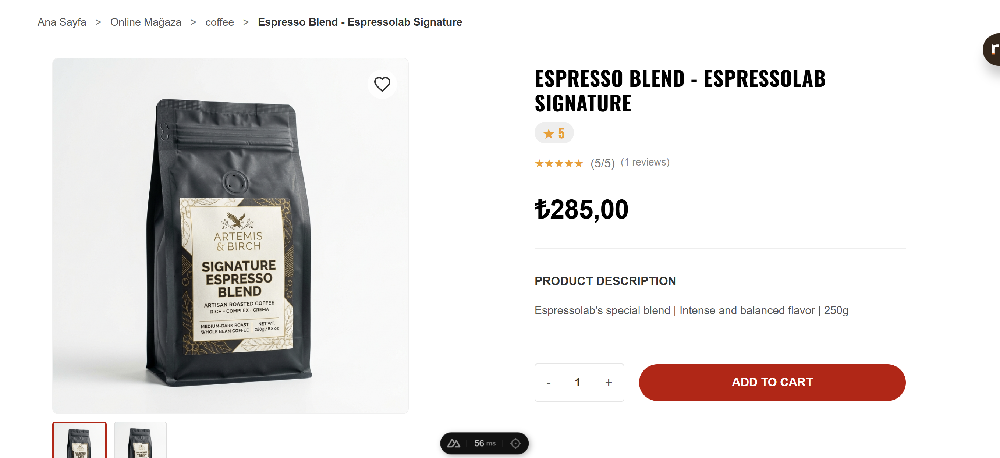
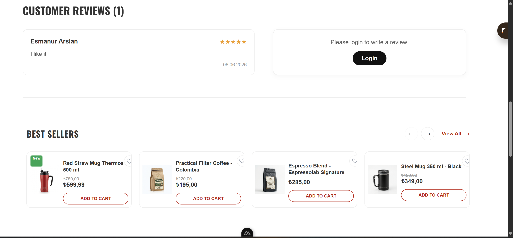
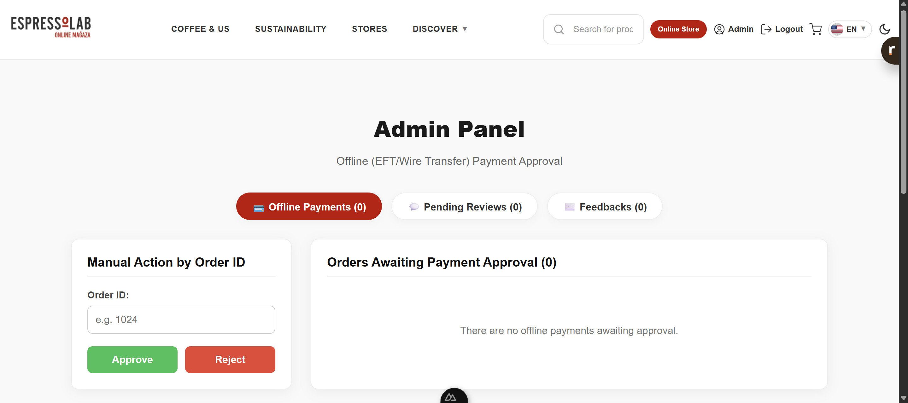

# ☕ Espressolab Enterprise E-Commerce & Management System

[](https://www.python.org/)
[](https://djangoproject.com/)
[](https://vuejs.org/)
[](https://www.rabbitmq.com/)
[](https://stripe.com/)
[](https://www.sqlite.org/)

Bu proje, Türkiye’nin en büyük üçüncü nesil kahve zincirlerinden biri olan **Espressolab**’in kurumsal operasyonlarını, B2C satış kanallarını, müşteri sipariş süreçlerini ve bayi (Franchising) yönetim süreçlerini dijitalleştirmek amacıyla geliştirilmiş kapsamlı bir **Kurumsal E-Ticaret Otomasyon ve Bilgi Yönetim Sistemi**dir. 

Sistem; son kullanıcıların üyelik oluşturup alışveriş yapabildikleri, online/offline ödemelerle sipariş verebildikleri, ürünlere puan ve yorum bırakabildikleri **Satış Modülleri** ile yöneticilerin tüm bu süreçleri denetleyebildikleri kapsamlı bir **Admin Yönetim Paneli** içerir.

---

## 🛠️ Teknik Yığın (Tech Stack)

Proje, modern yazılım mimarisi prensiplerine uygun olarak **Thin Client (Frontend)** ve **RESTful API (Backend)** mimarisiyle iki bağımsız katmanda yapılandırılmıştır:

*   **Backend (Sunucu Katmanı):** Core iş mantığı, veritabanı ilişkileri ve yönetim servisleri **Python (Django)** altyapısı ve **FastAPI** RESTful API entegrasyonu kullanılarak geliştirilmiştir. API uç noktaları Pydantic şemaları ile doğrulanmakta ve SQLAlchemy ORM ile veritabanına yansıtılmaktadır.
*   **Frontend (İstemci Katmanı):** Kullanıcı arayüzü ve reaktif durum yönetimi **Vue.js** (Nuxt 3 framework'ü) kullanılarak oluşturulmuştur. Durum yönetimi için **Pinia**, form doğrulamaları için **Vee-Validate & Yup** ve sosyal oturum açma (Google/Facebook OAuth2) entegrasyonları için **Firebase SDK** tercih edilmiştir.
*   **Asenkron İşlemler:** Sipariş ve ödeme sonrası fatura oluşturma, bildirim gönderme ve e-posta kuyruk yönetimi gibi arkaplan işlemleri için **RabbitMQ** (AMQP protokolü, `pika` kütüphanesi) kullanılmıştır.
*   **Veritabanı:** Taşınabilir, ilişkisel bütünlüğe sahip ve yüksek performanslı **SQLite** veritabanı kullanılmıştır.

---

## ✨ Temel Özellikler (Features)

1.  **Kimlik Doğrulama & Yetkilendirme (Auth):**
    *   E-posta ve şifreli güvenli giriş (`bcrypt` tuzlanmış hash altyapısı).
    *   Firebase SDK tabanlı Google ve Facebook OAuth2 sosyal oturum entegrasyonu.
    *   Rol Tabanlı Erişim Kontrolü (RBAC) ile normal kullanıcı ve Admin sayfalarının ayrılması.
2.  **Katalog & Ürün Yönetimi:**
    *   Kategori bazlı filtreleme, arama ve detaylı ürün listeleme.
    *   İlişkisel bütünlüğü korumak amacıyla ürün kaldırma işlemlerinde soft-delete (`is_active = False`) mekanizması.
3.  **Sepet & Sipariş İşlemleri:**
    *   Gerçek zamanlı stok kontrolü (stok sınırını aşan sepet eklemelerinin engellenmesi).
    *   Sipariş esnasında stokların rezerve edilmesi ve sepetin boşaltılması.
    *   Ödeme iptallerinde veya Admin tarafından sipariş reddinde rezerve edilen stokların otomatik iade edilmesi.
4.  **Ödeme Entegrasyonları:**
    *   **Çevrimiçi Ödeme:** Stripe API Sandbox kart doğrulama ve anlık ödeme provizyonu.
    *   **Çevrimdışı Ödeme (Havale/EFT):** Banka transferi bildirimleri. Siparişler Admin onayına düşer ve onaylandığında durumları güncellenir.
5.  **Yorum & Değerlendirme Sistemi:**
    *   Ürünlere 1-5 arası yıldızlı puan ve yorum bırakabilme.
    *   Güvenlik ve kalite standartları gereği yorumlar varsayılan olarak onay bekler (`is_approved = False`). Admin onayından sonra storefront'ta listelenir ve ürünün ortalama puanını reaktif günceller.
6.  **Geri Bildirim Kutusu (Feedback):**
    *   Kullanıcıların öneri, şikayet ve bilgi talebi gönderebilmesi.
    *   Geri bildirimlerin Admin panelinde listelenmesi ve okunmuş olarak işaretlenebilmesi.

---

## 📐 Sistem Mimarisi ve UML Diyagramları

### 1. Genel Bileşen Mimarisi (3-Tier Architecture)

Uygulamanın mantıksal katmanları ve veri akışları aşağıdaki gibidir:



### 2. Sipariş ve Ödeme Akış Şeması (Sequence Diagram)



---

## 🗄️ Veritabanı Modeli (ERD)

Sistem ilişkisel veri bütünlüğünü 7 tablo üzerinden sağlar. Cascading kuralları veritabanı seviyesinde aktiftir:



---

## 📁 Proje Dizin Yapısı

```text
Espressolab_Final_Project/
│
├── Backend/                      # Python API & Sunucu Katmanı
│   ├── main.py                   # API Giriş Noktası & Sunucu Başlatma
│   ├── database.py               # SQLAlchemy Bağlantısı & Session Yapılandırması
│   ├── models.py                 # Veritabanı Modelleri
│   ├── schemas.py                # Pydantic Şemaları
│   ├── queue_service.py          # RabbitMQ Producer (Yayıncı)
│   ├── queue_consumer.py         # RabbitMQ Consumer (Arka Plan Worker)
│   ├── seed_data.py              # Mock Veri Ekleme Scripti
│   ├── routers/                  # API Endpoint Modülleri (auth, orders, cart vb.)
│   └── tests/                    # Pytest Entegrasyon Testleri
│
└── Frontend/                     # Vue.js / Nuxt 3 İstemci Katmanı
    ├── app.vue                   # Kök Vue Bileşeni & Global CSS
    ├── nuxt.config.ts            # Nuxt Modül ve Eklenti Konfigürasyonu
    ├── components/               # Atomik Tasarıma Göre Ayrılmış Bileşenler (atoms, molecules, organisms)
    ├── pages/                    # Dosya Tabanlı Sayfalar ve Yönlendirmeler
    ├── stores/                   # Pinia Global State Yönetimi (auth, cart, products)
    └── utils/                    # Dil Paketleri (TR/EN i18n Sözlükleri)
```

---

## ⚙️ Kurulum ve Çalıştırma Kılavuzu

Uygulamayı yerel ortamda çalıştırmak için aşağıdaki adımları sırasıyla uygulayınız:

### 1. Backend Kurulumu ve Başlatılması

1.  **Gerekli dizine geçiş yapın:**
    ```bash
    cd Backend
    ```
2.  **Sanal ortam (virtualenv) oluşturun ve aktifleştirin:**
    ```bash
    python -m venv .venv
    # Windows için:
    .\.venv\Scripts\activate
    # Linux / macOS için:
    source .venv/bin/activate
    ```
3.  **Gerekli kütüphaneleri yükleyin:**
    ```bash
    pip install -r requirements.txt
    ```
4.  **Veritabanını oluşturun ve varsayılan verileri yükleyin (Seeding):**
    ```bash
    python seed_data.py
    ```
5.  **FastAPI Sunucusunu başlatın:**
    ```bash
    python -m uvicorn main:app --reload
    ```
    *API Swagger dokümantasyonuna [http://localhost:8000/docs](http://localhost:8000/docs) adresinden erişebilirsiniz.*
6.  **Asenkron RabbitMQ İşleyicisini (Worker) başlatın:**
    *(RabbitMQ servisinin yerel makinenizde çalıştığından emin olunuz)*
    ```bash
    python queue_consumer.py
    ```

### 2. Frontend Kurulumu ve Başlatılması

1.  **Gerekli dizine geçiş yapın:**
    ```bash
    cd ../Frontend
    ```
2.  **Bağımlılıkları (NPM Paketleri) yükleyin:**
    ```bash
    npm install
    ```
3.  **Geliştirici Sunucusunu (Development Server) başlatın:**
    ```bash
    npm run dev
    ```
    *Kullanıcı arayüzüne tarayıcınızdan [http://localhost:3000](http://localhost:3000) adresinden erişebilirsiniz.*

---

## 🧪 Testlerin Çalıştırılması

Sistem kararlılığını test etmek için geliştirilen birim ve entegrasyon testlerini çalıştırmak için:

*   **Backend Testleri (Pytest):**
    ```bash
    cd Backend
    pytest
    ```
*   **Frontend Testleri (Vitest):**
    ```bash
    cd Frontend
    npm run test
    ```

---

## 📸 Arayüz Ekran Görüntüleri (UI Showcase)

Aşağıda uygulamanın modern, koyu temalı (dark brand) tasarımını gösteren üretim ortamı ekran görüntüleri yer almaktadır:

### 1. Mağaza Arayüzü (Storefront Grid)


### 2. Ürün Detay & Yorum Alanı



### 3. Yönetici Kontrol Paneli (Admin Dashboard)

