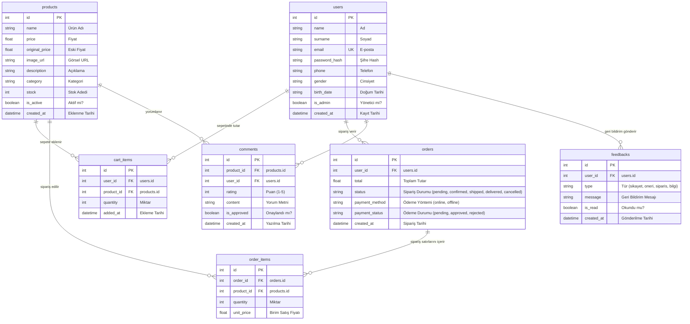

# ESPRESSOLAB E-TİCARET OTOMASYONU VE YÖNETİM SİSTEMİ
## Teknik Proje Raporu & Sistem Dokümantasyonu

---

## 1. Proje Tanımı ve Hedefleri

### 1.1. Projenin Amacı ve Kapsamı
Bu proje, Türkiye’nin en büyük üçüncü dalga kahve zincirlerinden biri olan **Espressolab**’in kurumsal operasyonlarını, online sipariş süreçlerini, kullanıcı deneyimlerini ve bayi (Franchising) yönetim süreçlerini dijitalleştirmeyi amaçlayan kapsamlı bir **Kurumsal E-Ticaret Otomasyon Platformu**dur. 

Proje kapsamında; müşterilerin üyelik oluşturabildiği, ürünleri kategorize edilmiş şekilde inceleyebildiği, sepet süreçlerini yönetebildiği, hem online (Stripe sandbox) hem de offline (Banka Havalesi/EFT) ödeme yöntemleriyle sipariş verebildiği bir son kullanıcı sistemi (B2C) tasarlanmıştır. Ayrıca yöneticilerin siparişleri, ödemeleri, yıldızlı puanlama/yorumları ve kullanıcı geri bildirimlerini denetleyebileceği bir **Admin Yönetim Paneli** geliştirilmiştir.

### 1.2. Kurumsal Süreçler ve Fonksiyonlar
Platform üzerinde aşağıdaki temel kurumsal süreçler simüle edilmiştir:
1.  **Üyelik ve Kimlik Doğrulama:** E-posta/Şifre tabanlı kayıt ve giriş işlemlerinin yanı sıra Google OAuth2 ile sosyal medya entegrasyonu.
2.  **Sipariş ve Stok Yönetimi:** Sipariş sırasında veri tutarlılığını korumak için gerçek zamanlı stok kontrolleri, sipariş onayında stok rezerve edilmesi ve ödeme başarısızlığında/iptal durumunda stoğun otomatik olarak iade edilmesi.
3.  **Ödeme ve Finans Entegrasyonu:**
    *   **Online Ödemeler:** Stripe API sandbox ortamı kullanılarak kredi kartı provizyonlarının alınması, ödeme onayında sipariş durumunun otomatik güncellenmesi.
    *   **Offline Ödemeler (Havale/EFT):** Kullanıcının banka bilgilerini alarak sipariş oluşturması, siparişin "Bekliyor" (Pending) durumunda kalması ve Admin paneli üzerinden yönetici tarafından onaylandığında "Onaylandı" durumuna geçmesi.
4.  **Ürün Yorum ve Puanlama Yönetimi:** Ürün sayfalarında 1-5 arası yıldızlı puanlama ve metin yorumu yapılması. Yorumlar, SQL veritabanına varsayılan olarak `is_approved = False` durumuyla kaydedilir. Admin panelinden onaylanana kadar ürün sayfasında listelenmez. Onaylandıktan sonra ise ürünün ortalama puanına (Average Rating) anlık olarak etki eder.
5.  **Kullanıcı Geri Bildirim (Feedback) Sistemi:** Kullanıcıların profil sayfalarından şikayet, öneri, sipariş veya bilgi başlıkları altında mesaj göndermesi. Bu mesajlar veritabanına `is_read = False` olarak kaydedilir ve Admin panelindeki özel bir sekmede listelenerek yöneticinin "Okundu" olarak işaretlemesine olanak sağlar.

---

## 2. Mimari ve Dizin Yapısı

### 2.1. İstemci-Sunucu Ayrımı (Separation of Concerns)
Uygulama, modern web geliştirme standartlarına uygun olarak **Thin Client (Frontend)** ve **REST API (Backend)** mimarisiyle iki bağımsız katmana ayrılmıştır:
*   **İstemci (Frontend):** Nuxt 3 (Vue 3 tabanlı) kullanılarak geliştirilmiş, kullanıcı arayüzü (UI) ve kullanıcı deneyimi (UX) süreçlerini yürüten katmandır. Sunucudan sadece ham JSON verisi talep eder ve arayüzü istemci tarafında (Client-Side Rendering) reaktif olarak günceller.
*   **Sunucu (Backend):** FastAPI (Python) kullanılarak geliştirilmiş, tüm iş mantığının (Business Logic), veritabanı işlemlerinin (ORM), asenkron kuyruk yayınlarının (RabbitMQ) ve dış servis entegrasyonlarının (Stripe) yönetildiği RESTful API katmandır.

### 2.2. Dizin Yapısı ve Mantığı

Proje dizin yapısı, kurumsal yazılım prensipleri doğrultusunda modüler ve katmanlı olarak yapılandırılmıştır:

```text
Espressolab_Final_Project/
│
├── Backend/                      # FastAPI Sunucu Katmanı
│   ├── database.py               # SQLAlchemy Bağlantısı ve SessionLocal
│   ├── main.py                   # API Başlangıç Noktası (Router Kayıtları)
│   ├── models.py                 # SQLAlchemy Veritabanı Modelleri (ERD)
│   ├── schemas.py                # Pydantic Veri Doğrulama Şemaları
│   ├── queue_service.py          # RabbitMQ Producer (Kuyruğa Mesaj Gönderme)
│   ├── queue_consumer.py         # RabbitMQ Worker (Kuyruktan Mesaj İşleme)
│   ├── seed_data.py              # Veritabanı Seed Scripti (Mock Ürün ve Kullanıcı)
│   ├── routers/                  # API Endpoint Modülleri (Routers)
│   │   ├── auth.py               # Kimlik Doğrulama API
│   │   ├── cart.py               # Alışveriş Sepeti API
│   │   ├── comments.py           # Yorum ve Puanlama API
│   │   ├── feedbacks.py          # Kullanıcı Geri Bildirim API
│   │   ├── orders.py             # Sipariş Yönetim API
│   │   ├── payments.py           # Stripe ve Havale API
│   │   ├── products.py           # Ürün Yönetim API
│   │   └── users.py              # Kullanıcı Bilgileri API
│   └── tests/                    # Pytest Entegrasyon Testleri
│
└── Frontend/                     # Nuxt 3 İstemci Katmanı
    ├── app.vue                   # Global Nuxt Arayüzü ve Dark Mode CSS
    ├── nuxt.config.ts            # Nuxt Konfigürasyonu (Pinia, Tailwind vb.)
    ├── components/               # Atomik Tasarım Yapısına Göre Vue Bileşenleri
    │   ├── atoms/                # BaseButton, ProfileNavLink, BaseRating vb.
    │   ├── molecules/            # CampaignCard, Breadcrumbs, ProductCard vb.
    │   └── organisms/            # StoreBestSellers, TheHeader, TheFooter vb.
    ├── composables/              # Reaktif Fonksiyonlar (useI18n, useTheme, useToast)
    ├── layouts/                  # default.vue Şablonu
    ├── middleware/               # auth.ts ve admin.ts Yönlendirme Korumaları
    ├── pages/                    # Dosya Tabanlı Yönlendirme (Pages)
    │   ├── admin.vue             # Yönetici Kontrol Paneli
    │   ├── profile.vue           # Profil ve Görüş Bildirme Sayfası
    │   ├── campaigns.vue         # Kampanyalar Sayfası
    │   ├── store/                # Mağaza Sayfaları
    │   └── product/
    │       └── [id].vue          # Ürün Detay ve Puanlama/Yorum Sayfası
    ├── stores/                   # Pinia Durum Yönetimi (auth, cart, products)
    └── utils/
        └── locales.ts            # TR/EN Dil Sözlüğü (i18n)
```

---

## 3. Teknolojiler ve Kütüphaneler

Yazılım geliştirme sürecinde kullanılan temel kütüphaneler ve bunların tercih edilme gerekçeleri (**Justification**) şu şekildedir:

### 3.1. Frontend Teknolojileri
*   **Vue 3 & Nuxt 3:** Vue 3'ün **Composition API** yapısı, reaktif veri yönetimini ve kodun tekrar kullanılabilirliğini artırır. **Nuxt 3** ise dosya tabanlı yönlendirme (file-based routing), otomatik bileşen import etme (auto-imports) özellikleri sayesinde frontend geliştirme sürecini büyük ölçüde hızlandırır.
*   **Pinia:** Vuex'in yerini alan modern durum yönetimi (State Management) kütüphanesidir. TypeScript desteği ve modüler yapısı sayesinde sepet (`cart`), kullanıcı oturumu (`auth`) ve ürün durumlarını yönetmek için seçilmiştir.
*   **Vee-Validate & Yup:** Kullanıcı kayıt, giriş ve adres formlarının istemci tarafında anlık doğrulamasını (validation) sağlamak için kullanılmıştır. Yup ise şema tabanlı doğrulama kurallarının hızlı yazılmasını sağlar.
*   **Firebase SDK:** Google/Facebook OAuth2 kimlik doğrulama süreçlerini yönetmek için entegre edilmiştir.

### 3.2. Backend Teknolojileri
*   **FastAPI:** Python dünyasındaki en hızlı async REST API framework'lerinden biridir. Asenkron (async/await) yapısı sayesinde yüksek eşzamanlı istek kapasitesine sahiptir. Ayrıca **Swagger UI** (`/docs`) arayüzünü otomatik üretmesi, test ve entegrasyon süreçlerini kısaltır.
*   **SQLAlchemy (v2.0):** Python'un en gelişmiş Nesne-İlişkisel Eşleme (ORM) arayüzüdür. SQL sorgularını nesne tabanlı yazarak veritabanı bağımsızlığı sağlar ve SQL enjeksiyon açıklarını önler.
*   **Pydantic (v2):** FastAPI ile entegre çalışarak API istek ve yanıtlarındaki veri tiplerinin doğrulanmasını (data validation & serialization) sağlar.
*   **Pika:** Backend'in RabbitMQ mesaj kuyruğuna asenkron olarak bağlanabilmesi ve kuyruğa sipariş/ödeme olaylarını iletebilmesi (publisher/consumer) için seçilmiş hafif ve güçlü bir AMQP kütüphanesidir.
*   **Passlib (Bcrypt):** Kullanıcı şifrelerinin SHA-256 tabanlı, tuzlanmış (salted) `bcrypt` algoritması ile veritabanına güvenli şekilde kaydedilmesini sağlar.
*   **Stripe SDK:** Online kredi kartı ödemelerinin sanal POS üzerinden tahsil edilmesini sağlayan global ödeme ağ geçididir.

---

## 4. Sistem Tasarımı (UML)

Sistemin çalışma mantığı ve mimarisi aşağıdaki UML tanımlamaları ile hocanıza çizim için rehberlik edecek şekilde betimlenmiştir:

### 4.1. Use Case (Kullanım Senaryoları) Diyagramı Tanımı
*   **Aktörler:** 
    *   **Ziyaretçi (Unauthenticated User):** Sisteme giriş yapmamış kullanıcı.
    *   **Kullanıcı (Authenticated User):** Sisteme giriş yapmış müşteri.
    *   **Yönetici (Admin):** Sistem yöneticisi.
*   **Kullanım Senaryoları İlişkileri:**
    *   *Ziyaretçi* -> Ürünleri Listele, Kategorileri İncele, Kampanyaları Görüntüle, Giriş Yap / Kaydol.
    *   *Kullanıcı* -> Sepete Ürün Ekle, Sepeti Güncelle, Kredi Kartı ile Öde (Online), Havale/EFT ile Öde (Offline), Profil Bilgilerini Güncelle, Adres Ekle/Sil/Düzenle, Ürüne Yıldızlı Yorum Yaz, Görüş/Geri Bildirim Bildir.
    *   *Yönetici* -> Ürün Ekle/Sil/Düzenle, Çevrimdışı Ödemeleri Onayla/Reddet, Bekleyen Yorumları Onayla/Sil, Kullanıcı Geri Bildirimlerini Gör ve Okundu İşaretle.

### 4.2. Sistem Mimarisi (Architecture) Diyagramı Tanımı
Sistem **3 Katmanlı (3-Tier) Mimari** yapısına sahiptir:
1.  **Sunum Katmanı (Presentation Layer):** Nuxt 3 uygulamasıdır. Kullanıcıdan girdileri alır, Pinia store'ları günceller ve FastAPI sunucusu ile HTTPS üzerinden haberleşir.
2.  **Uygulama Katmanı (Application / Logic Layer):** FastAPI sunucusudur. Gelen HTTP isteklerini doğrular, iş kurallarını uygular, Stripe ödemelerini tetikler ve asenkron işlemleri RabbitMQ kuyruğuna (`espressolab_queue`) yollar.
3.  **Veri Katmanı (Data Layer):** 
    *   **SQLite Veritabanı:** Tüm ilişkisel verileri saklar.
    *   **RabbitMQ Consumer (Worker):** Kuyruktaki sipariş ve ödeme olaylarını dinleyen, arkaplanda çalışan Python sürecidir.

---

## 5. Veritabanı Şeması (ERD)

Otomasyon sistemi, ilişkisel bütünlüğün (referential integrity) ve yabancı anahtar (Foreign Key) kısıtlamalarının tam uygulandığı 7 tablodan oluşur:



### 5.1. İlişkiler ve Silme Kısıtlamaları (Cascade Policies)
*   **users - comments / feedbacks:** Bir kullanıcı hesabı silindiğinde (`DELETE`), bu kullanıcının yazdığı tüm yorumlar ve geri bildirimler de veritabanından temizlenir (`cascade="all, delete-orphan"`).
*   **products - comments:** Bir ürün silindiğinde, ürüne yapılmış tüm onaylı veya onay bekleyen yorumlar veritabanından otomatik olarak silinir.
*   **orders - order_items:** Sipariş silindiğinde alt sipariş satırları da temizlenir.

---

## 6. API ve İletişim

FastAPI sunucumuz, RESTful web servisi standartlarına uygun olarak tasarlanmıştır. İsteklerin kabulü ve yanıtların dönülmesinde JSON formatı kullanılır. HTTP durum kodları (Status Codes) işlem sonucuna göre seçilir:

| Metot | Uç Nokta (Endpoint) | Açıklama | Beklenen Yanıt Kodları |
| :--- | :--- | :--- | :--- |
| **POST** | `/auth/login` | E-posta ve şifre ile sisteme giriş yapar. | `200 OK`, `401 Unauthorized` |
| **POST** | `/auth/social-login` | Google/Facebook profili ile otomatik hesap oluşturur/giriş yapar. | `200 OK`, `400 Bad Request` |
| **GET** | `/products` | Aktif ürünleri kategorilere göre filtreleyerek listeler. | `200 OK` |
| **GET** | `/products/{id}` | Belirli bir ürünün tüm detaylarını döner. | `200 OK`, `404 Not Found` |
| **POST** | `/orders` | Alışveriş sepetindeki ürünleri siparişe dönüştürür, stoktan rezerve eder. | `201 Created`, `400 Bad Request` |
| **POST** | `/payments/online` | Alınan Stripe tokenı ile online tahsilat yapar, onayda siparişi onaylar. | `200 OK`, `402 Payment Required` |
| **GET** | `/comments/product/{id}` | Sadece onaylanmış (`is_approved: true`) ürün yorumlarını getirir. | `200 OK` |
| **POST** | `/comments/` | Yeni bir yorum ve yıldız puanı ekler (`is_approved` varsayılan: `false`). | `201 Created`, `400 Bad Request` |
| **GET** | `/comments/pending` | Onay bekleyen tüm yorumları getirir (Yalnızca Admin). | `200 OK`, `403 Forbidden` |
| **PATCH** | `/comments/{id}/approve` | Yorumun onay durumunu `true` yapar (Yalnızca Admin). | `200 OK`, `403 Forbidden` |
| **DELETE** | `/comments/{id}` | Yorumu veritabanından kaldırır / reddeder (Yalnızca Admin). | `204 No Content`, `403 Forbidden` |
| **POST** | `/feedbacks/` | Kullanıcının gönderdiği geri bildirimi kaydeder (`is_read` varsayılan: `false`). | `201 Created`, `404 User Not Found` |
| **GET** | `/feedbacks/` | Tüm geri bildirimleri okunmamışlar öncelikli listeler (Yalnızca Admin). | `200 OK`, `403 Forbidden` |
| **PATCH** | `/feedbacks/{id}/read` | Geri bildirimi okundu olarak işaretler (Yalnızca Admin). | `200 OK`, `403 Forbidden` |

---

## 7. Asenkron Mekanizmalar (RabbitMQ)

Sistemde, ana uygulama iş parçacığının (Main Thread) bloke olmasını önlemek ve sistem performansını maksimize etmek amacıyla **RabbitMQ** mesaj kuyruğu mimarisi kullanılmıştır.

```text
FastAPI (REST API) ──────[ pika Publisher ]──────> [ RabbitMQ Broker ]
                                                           │
                                                           ▼
[ Worker Consumer ] <────[ background task ]─────── espressolab_queue
```

### 7.1. Mesaj Kuyruğu Olayları (Events)
Sipariş ve ödeme süreçlerinde, FastAPI API katmanı iş kurallarını tamamladıktan sonra `queue_service.py` aracılığıyla kuyruğa bir olay (event) fırlatır ve istemciye hemen yanıt döner:
*   `payment_processed`: Başarılı bir ödeme tahsil edildiğinde arkaplanda fatura hazırlanması ve e-posta gönderimi sürecini tetikler.
*   `payment_failed`: Başarısız kart işlemlerinde hata günlüğü oluşturulması sürecini tetikler.
*   `offline_payment_reviewed`: Çevrimdışı siparişin onaylandığını veya reddedildiğini raporlar.

### 7.2. Hata Toleransı ve Çevrimdışı Güvence (Resiliency Fallback)
Eğer RabbitMQ sunucusu geçici olarak kapalıysa veya ulaşılamıyorsa, `queue_service.py` içerisindeki `publish_event` fonksiyonu hatayı yakalar (catch) ve sistemin çökmesini engellemek için yerel log dosyasına yazarak işleme devam eder. Bu sayede ödeme alan kullanıcı, kuyruk servisinin kesintisinden etkilenmez.

---

## 8. Durum Yönetimi (State Management)

İstemci tarafında uygulamanın kararlı çalışabilmesi için reaktif durum yönetimi **Pinia** yardımıyla sürdürülmektedir:

### 8.1. Pinia Store Yapısı
1.  **Auth Store (`stores/auth.ts`):** Kullanıcı giriş tokenlarını, Firebase kullanıcı nesnesini ve `isAdmin` yetki durumlarını tutar.
2.  **Cart Store (`stores/cart.ts`):** Kullanıcının sepetindeki ürünleri, adetlerini ve indirim durumlarını kontrol eder. Sepet bilgileri `localStorage` ile entegre edilmiştir; bu sayede tarayıcı yenilense dahi sepet sıfırlanmaz.
3.  **Products Store (`stores/products.ts`):** Backend'den çekilen ürünlerin listesini önbelleğe alarak gereksiz API isteklerini önler.

### 8.2. i18n Dil Kalıcılığı (State Persistence)
Kullanıcı "TR" veya "EN" dil seçeneklerinden birini seçtiğinde, `useI18n` composable'ı bu seçimi `localStorage` içerisine yazar. Sayfalar arası geçişlerde veya kullanıcı siteyi kapatıp tekrar girdiğinde tercih edilen dil korunarak tarayıcı dil ayarının bozulması önlenir.

---

## 9. Test Raporu

Sistem güvenilirliğini artırmak için geliştirilen birim (Unit) ve entegrasyon (Integration) testlerinin kapsamı şu şekildedir:

### 9.1. Backend Pytest Sonuçları
`pytest` kullanılarak backend katmanında 58 test yazılmıştır. Tüm testler başarıyla geçmiştir (**58 passed**).
*   **test_auth.py:** Kullanıcı kaydı, şifreli girişler ve sosyal medya giriş senaryoları.
*   **test_cart.py:** Sepete ürün ekleme, miktar güncelleme ve stok sınır aşım testleri.
*   **test_comments.py:** Yorum ekleme, admin onaylama ve puan ortalaması testleri.
*   **test_feedbacks.py:** Kullanıcının profilinden geri bildirim atması ve adminin bunu okundu işaretlemesi.
*   **test_orders.py:** Sipariş oluşturma, geçersiz durum geçişlerinin engellenmesi.
*   **test_payments.py:** Stripe kart reddi/kabulü durumunda stok iade ve sipariş iptal doğrulama senaryoları.
*   **test_queue.py:** RabbitMQ kuyruk yayını ve çevrimdışı fallback mekanizması.

### 9.2. Frontend Vitest Sonuçları
Frontend tarafında `vitest` yardımıyla Pinia store mutasyonları doğrulanmıştır. Yapılan testler başarıyla tamamlanmıştır (**5 / 5 passed**).

---

## 10. Kurulum ve Çalıştırma Kılavuzu

Uygulamayı yerel ortamda (localhost) çalıştırmak için aşağıdaki adımları sırasıyla uygulayınız:

### 10.1. Backend Kurulumu ve Başlatılması
1.  **Sanal Ortam Oluşturma ve Kütüphane Kurulumu:**
    ```powershell
    cd Backend
    python -m venv .venv
    .\.venv\Scripts\activate
    pip install -r requirements.txt
    ```
2.  **Veritabanı Oluşturma ve Seed İşlemi:**
    ```powershell
    python seed_data.py
    ```
3.  **FastAPI Sunucusunu Başlatma:**
    ```powershell
    python -m uvicorn main:app --reload
    ```
    *   API Dokümantasyonu (Swagger UI): [http://localhost:8000/docs](http://localhost:8000/docs) adresinden görüntülenebilir.
4.  **Asenkron RabbitMQ Worker Başlatma:**
    *(RabbitMQ sunucusunun bilgisayarınızda çalıştığından emin olunuz)*
    ```powershell
    python queue_consumer.py
    ```

### 10.2. Frontend Kurulumu ve Başlatılması
1.  **Paketleri Yükleme:**
    ```powershell
    cd Frontend
    npm install
    ```
2.  **Geliştirici Sunucusunu Başlatma:**
    ```powershell
    npm run dev
    ```
    *   Uygulama Tarayıcı Arayüzü: [http://localhost:3000](http://localhost:3000) adresinden erişilebilir.

### 10.3. Testlerin Çalıştırılması
*   **Backend Testleri:** `pytest`
*   **Frontend Testleri:** `npm run test`
*   **Frontend Tip Kontrolü:** `npx vue-tsc --noEmit`
